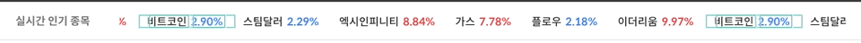
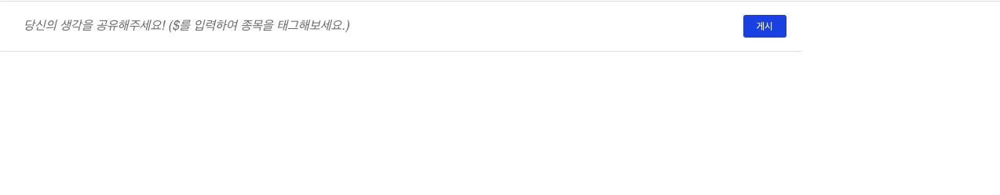

# 실시간 거래소 레벨의 WebSocket 통신과 Feed & Mention 구현하기

> `2021. 06. 01 ~ 2021. 06. 15 / workday 11 / (주)비바체스`

## [Product](https://antville.kr/)

## 0. 팀원

- 강중석

## 1. 주요 기능

- 국내/해외 주식, 비트코인의 가격을 웹소켓으로 제공

- redux-toolkit 파편화로 렌더링을 최적화

- 태그와 피드기능

- API 요청 최적화

## 2. 직면한 문제와 해결

### 촉박한 일정으로 빠르게 쳐내야하는 상황

- 웹소켓과 멘션기능은 레퍼런스가 많이 존재할 것이라고 판단
- 작업하기 앞서서 선례들을 충분하게 서베이하고 작업계획을 수립

### textarea 구조로 구현할 수 없는 멘션 기능

- 멘션기능을 구현하려면 input의 커서위치에 대응하여 멘션 미리보기를 구현해야 함.
- 하지만 input이나 textarea의 현재 커서위치를 html, css, javascript로 추적할 수 없음.
- 대표적인 소셜서비스 페이스북, 인스타그램, 트위터가 가지는 피드 구조를 살펴보고 textarea 가 아닌 일정한 구조를 가지고 있다는 것을 발견
- 그에 대응하는 라이브러리 리스트업을 함
- 페이스북이 만든 [draft-js](https://draftjs.org/docs/getting-started) 와 [tiptap](https://tiptap.dev/), [slate-react](https://docs.slatejs.org/libraries/slate-react), [suneditor-react](http://suneditor.com/sample/index.html)
- 관련해서 테스트를 진행하던 중 문제를 발견.
- 영어권 라이브러리라 알파벳과 다르게 한글에서 멘션 트리거가 오작동함
- ex) @b -> @ㅂ @비 // @비를 인식하지 못함
- 그래서 페이스북 같은 경우 사용자가 입력중에 실시간으로 반영 제공 x
- 하지만 기획에서 이 기능을 필수적으로 요구했고, 마땅한 라이브러리가 없다면 직접 구현해서 리소스가 많이 들 것이기에 일정에 대해 불안해짐
- 따라서 한번 더 강도높게 서베이를 진행하였고 [react-quill](https://github.com/zenoamaro/react-quill)과 플러그인 [quill-mention](https://github.com/quill-mention/quill-mention) 을 이용해서 커스텀 하면 구현 가능한 점을 발견
- typescript를 지원 안하지만 react 버전을 다운그레이드하면 구현할 수 있었고, 이에 대해 버전 변경 및 테스트를 진행
- module 메모라이즈 문제와 css 변경 등 사소한 문제가 발생했지만 해결하고 구현 완료

### 정적 데이터와 동적 웹소켓 데이터의 상태관리

- 24시간 거래소가 운영하는 비트코인과, 서로 다른 시간대의 운영되는 국내주식, 미국주식의 데이터관리 이슈가 떠오름
- 같은 데이터를 웹소켓과 API로 둘다 가져와야하는 상황
- 웹소켓 상태를 따로 관리하고 두개의 상태를 합치는 방법을 채택
- 따라서 react-query를 도입해 서버상태를 분리함에도 불구하고 가격 데이터는 RTK로 관리함

### 특정 종목이 렌더링되면 모든 종목이 렌더링 되는 이슈

- 특정 종목의 가격이 웹소켓 통신으로 인해 렌더링 되었을 때, 전체 종목에 대한 가격 UI가 렌더링이 되는 이슈를 발견.
- 비트코인,국내/해외 주식 데이터를 서비싱하기 위해선 성능 최적화가 필수라서 검토에 들어감.
- 렌더링 최적화 이슈라는 것을 알았고 상태에서 데이터를 파생해야할 필요성을 느낌.
- 따라서 reselect 기능이 내장된 [createSelector](https://redux-toolkit.js.org/api/createSelector)을 사용.
- createSelector로 상태를 [파편화](https://blog.isquaredsoftware.com/2017/12/idiomatic-redux-using-reselect-selectors/)하고 함수로 래핑해서 useMemo로 메모라이징함
- 웹소켓으로 전송되는 피드 데이터는 논캐싱 배열에 대해 처리할 필요성이 있기 때문에 [DraftSafeSelector](https://redux-toolkit.js.org/api/createSelector)를 이용해 배열 내부 값 트레킹함.
- 실시간 가격/피드 데이터 상태관리를 효율적이고 안정적으로 구축함.

## 3. 사용 스택

- React.js
- TypeScript
- redux-toolkit
- react-query
- emotion
